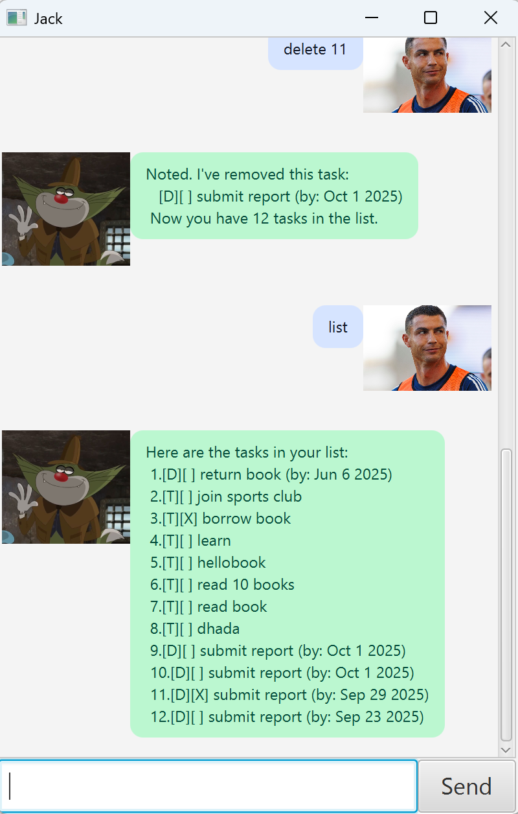

# Jack User Guide



Jack is a chatbot that helps you manage your tasks.  
This User Guide will show you how to install and use Jack.

---

## Quick Start
1. Ensure you have Java 11 installed.
2. Download the latest `jack.jar` from [releases](../../releases).
3. Run the program with:
   ```bash
   java -jar jack.jar
   ```
4. Type a command in the input box and press Enter.

5. Indexes shown in examples below are 1-based (the first task is index 1).

---

## Features
### Add a To-do
**Format:**  
`todo DESCRIPTION`

Adds a basic task with just a description.

**Example**
```
todo read book
```

**What you’ll see**
```
Got it. I've added this task:
  [T][ ] read book
Now you have N tasks in the list.
```

---

### Add a Deadline (supports natural dates)
**Format:**  
`deadline DESCRIPTION /by DATE`

`DATE` accepts ISO or natural expressions (see **Natural dates** below).

**Examples**
```
deadline submit report /by 2025-10-01
deadline return book /by 1 Oct 2025
deadline pay fees /by today
deadline schedule checkup /by next Mon
deadline send slides /by in 2 days
```

---

### Add an Event
**Format:**  
`event DESCRIPTION /from START /to END`

Free-form `START`/`END` text is accepted (e.g., `Aug 6 2pm`, `4pm`, `tomorrow 3pm`, etc.).

**Example**
```
event project meeting /from Aug 6 2pm /to 4pm
```

---

### List Tasks
**Format:**  
`list`

Shows all current tasks in the task list.

**Example**
```
list
```


---

### Delete a Task
**Format:**  
`delete INDEX`

Removes the task at the given index.

**Example**
```
delete 3
```

**What you’ll see**
```
Noted. I've removed this task:
  [D][ ] submit report (by: Oct 1 2025)
Now you have N tasks in the list.
```

---

### Mark a Task as Done
**Format:**  
`mark INDEX`

**Example**
```
mark 2
```

**What you’ll see**
```
Nice! I've marked this task as done:
  [T][X] read book
```

---

### Mark a Task as Not Done
**Format:**  
`unmark INDEX`

**Example**
```
unmark 2
```

**What you’ll see**
```
OK, I've marked this task as not done yet:
  [T][ ] read book
```

---

### Find Tasks
**Format:**  
`find KEYWORD`

Shows tasks whose description contains the keyword (case-insensitive).

**Examples**
```
find book
find report
```

---

### Exit the Program
**Format:**  
`bye`

Closes the application.


---

## Command Summary
- `todo DESCRIPTION`
- `deadline DESCRIPTION /by DATE`
- `event DESCRIPTION /from START /to END`
- `list`
- `mark INDEX`
- `unmark INDEX`
- `delete INDEX`
- `find KEYWORD`
- `bye`